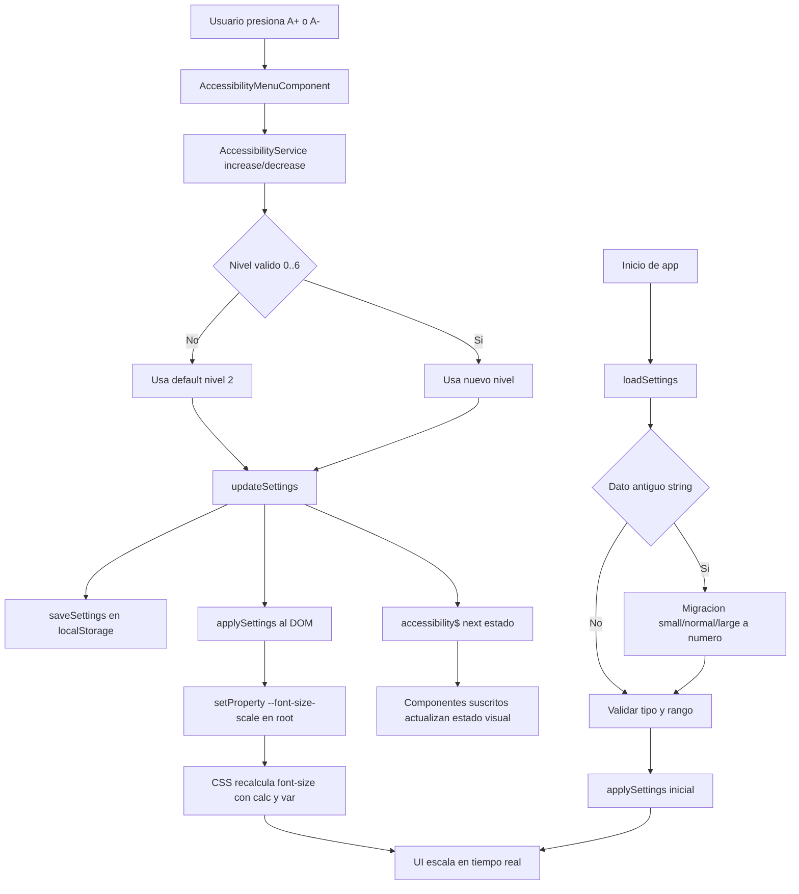

# A11Y Auto Flow (1 minuto)

Este es el flujo automatico completo del sistema de accesibilidad.

## Resumen rapido

1. El menu dispara el cambio de nivel.
2. El servicio valida, guarda y aplica al DOM.
3. Cambia `--font-size-scale` en `:root`.
4. Cualquier `font-size: calc(... * var(--font-size-scale))` responde solo.
5. En arranque, `loadSettings()` migra formatos viejos y evita errores.

## Guard rails automaticos

- Script: `npm run check:a11y`
- Bloquea errores tipicos: `font-size` fijo y `!important` en fuentes.
- Checklist y template de PR fuerzan verificacion antes de merge.
