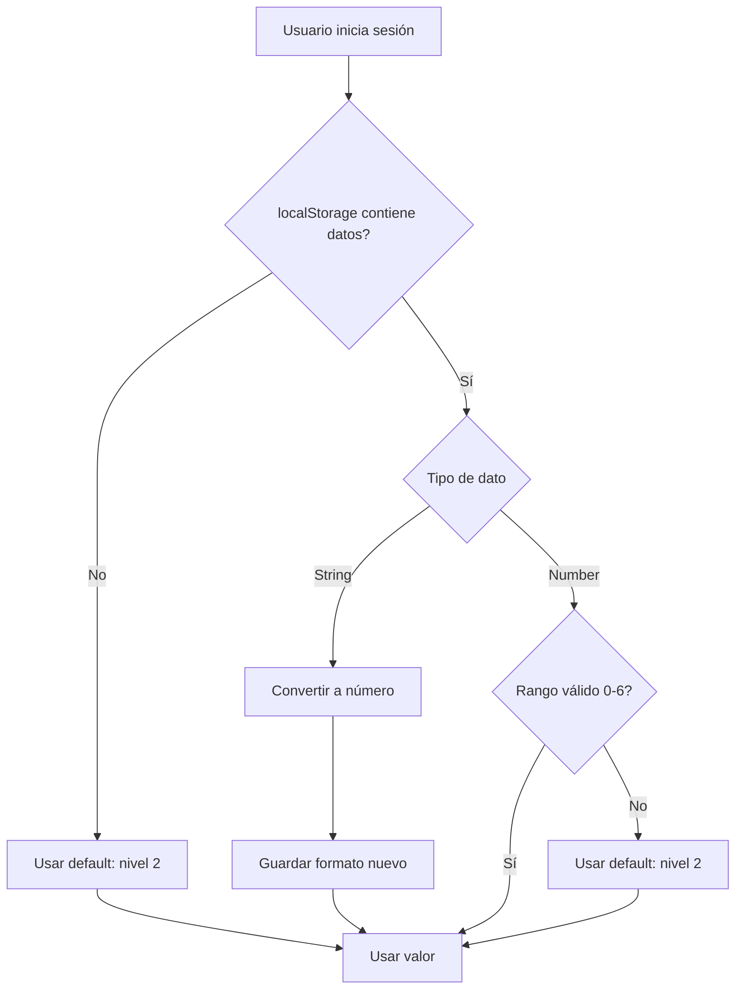

# 🔄 Guía de Migración: Sistema de Accesibilidad

## 📋 Resumen de Cambios

Esta guía explica la migración del sistema antiguo de **3 niveles** al nuevo sistema de **7 niveles** de accesibilidad.

---

## 🔴 Sistema Antiguo (3 niveles)

### ❌ Cómo era antes

```typescript
// accessibility.service.ts (ANTIGUO)
fontSize: 'small' | 'normal' | 'large'  // Strings

// localStorage
{ "fontSize": "normal" }  // Formato string

// SCSS
font-size: 14px;  // Valores fijos
font-size: 16px;  
font-size: 18px;  
```

### ❌ Problemas del Sistema Antiguo

1. **Solo 3 opciones**: Insuficiente para usuarios con diferentes necesidades
2. **Valores fijos**: Muchos textos NO escalaban
3. **No cumplía WCAG 2.1**: No alcanzaba 200% de zoom requerido
4. **Strings en localStorage**: Propenso a errores de tipo

---

## 🟢 Sistema Nuevo (7 niveles)

### ✅ Cómo es ahora

```typescript
// accessibility.service.ts (NUEVO)
fontSize: 0 | 1 | 2 | 3 | 4 | 5 | 6  // Números

// localStorage
{ "fontSize": 2 }  // Formato numérico

// SCSS
font-size: calc(14px * var(--font-size-scale));  // Responsive
```

### ✅ Tabla de Niveles

| Nivel | Escala | Descripción    | Equivale a Antiguo |
|-------|--------|----------------|-------------------|
| 0     | 0.75x  | Muy pequeña    | -                 |
| 1     | 0.85x  | Pequeña        | 'small'           |
| 2     | 1.0x   | Normal ⭐      | 'normal'          |
| 3     | 1.15x  | Mediana        | -                 |
| 4     | 1.3x   | Grande         | 'large'           |
| 5     | 1.5x   | Muy grande     | -                 |
| 6     | 1.75x  | Extra grande   | -                 |

⭐ **Nivel 2 es el default** (100% / normal)

### ✅ Mejoras

1. **7 opciones**: Mayor granularidad para usuarios
2. **Valores dinámicos**: TODO el texto escala automáticamente
3. **Cumple WCAG 2.1 AA**: Alcanza 200% (nivel 6 = 175%, + zoom navegador)
4. **Type-safe**: Números en lugar de strings

---

## 🔄 Migración Automática

### ¿Qué pasa con usuarios existentes?

El sistema **migra automáticamente** los datos antiguos:

```typescript
// accessibility.service.ts - loadSettings()

// Conversión automática
'small'  → 1  // (0.85x)
'normal' → 2  // (1.0x) - DEFAULT
'large'  → 3  // (1.15x)

// Cualquier otro valor → 2 (default)
```

### Flujo de Migración



**IMPORTANTE**: La migración es **transparente** para el usuario. No necesita hacer nada.

---

## 👨‍💻 Para Desarrolladores

### ¿Qué cambió en el código?

#### 1. Service (accessibility.service.ts)

```typescript
// ❌ ANTES
fontSize: 'small' | 'normal' | 'large'
getFontSizeScale(size: string): number {
  switch(size) {
    case 'small': return 0.85;
    case 'large': return 1.15;
    default: return 1;
  }
}

// ✅ AHORA
fontSize: number  // 0-6
FONT_SIZE_SCALES = [0.75, 0.85, 1, 1.15, 1.3, 1.5, 1.75];
getFontSizeScale(fontSize: number): number {
  return this.FONT_SIZE_SCALES[fontSize] ?? 1;
}
```

#### 2. Component (accessibility-menu.ts)

```typescript
// ❌ ANTES
fontSize: string = 'normal';
isFontSizeSmall = this.fontSize === 'small';
isFontSizeLarge = this.fontSize === 'large';

// ✅ AHORA
fontSize: number = 2;
isFontSizeSmall = this.fontSize === 0;
isFontSizeLarge = this.fontSize === 6;
currentFontLevel = `${this.fontSize + 1}/7`;  // "3/7"
```

#### 3. Styles (SCSS)

```scss
/* ❌ ANTES */
.texto {
  font-size: 14px;  /* No escala */
}

/* ✅ AHORA */
.texto {
  font-size: calc(14px * var(--font-size-scale));  /* Escala dinámicamente */
}
```

### ¿Qué necesitas cambiar en tu código?

**Si estás creando componentes NUEVOS:**
- Usa SIEMPRE `calc(Npx * var(--font-size-scale))` en todos los `font-size`
- Usa snippets `a11y-font-px` en VS Code
- Ejecuta `npm run check:a11y` antes de commit

**Si estás manteniendo componentes VIEJOS:**
- Ya están migrados (~100+ conversiones)
- Solo mantén el patrón en nuevas líneas que agregues
- Ejecuta `npm run check:a11y` para verificar

---

## 🧪 Testing de Migración

### Test Manual

1. **Caso 1: Usuario nuevo**
   ```bash
   # 1. Abrir modo incógnito
   # 2. Login
   # 3. Abrir DevTools > Application > Local Storage
   # Resultado esperado: { "fontSize": 2 }
   ```

2. **Caso 2: Usuario existente (string antiguo)**
   ```bash
   # 1. Abrir DevTools > Application > Local Storage
   # 2. Editar manualmente: { "fontSize": "normal" }
   # 3. Refrescar página
   # 4. Verificar DevTools nuevamente
   # Resultado esperado: { "fontSize": 2 } (convertido automáticamente)
   ```

3. **Caso 3: Dato corrupto**
   ```bash
   # 1. Editar localStorage: { "fontSize": 999 }
   # 2. Refrescar página
   # Resultado esperado: { "fontSize": 2 } (fallback a default)
   ```

### Test Automatizado

```typescript
// accessibility.service.spec.ts (ejemplo)
describe('Migration from old format', () => {
  it('should convert "small" to 1', () => {
    localStorage.setItem('accessibilitySettings', JSON.stringify({ fontSize: 'small' }));
    service = new AccessibilityService();
    expect(service.fontSize).toBe(1);
  });

  it('should convert "normal" to 2', () => {
    localStorage.setItem('accessibilitySettings', JSON.stringify({ fontSize: 'normal' }));
    service = new AccessibilityService();
    expect(service.fontSize).toBe(2);
  });

  it('should convert "large" to 3', () => {
    localStorage.setItem('accessibilitySettings', JSON.stringify({ fontSize: 'large' }));
    service = new AccessibilityService();
    expect(service.fontSize).toBe(3);
  });
});
```

---

## 📊 Estado de Conversión

### Archivos Convertidos ✅

- ✅ `styles.scss` (24 conversiones)
- ✅ `accessibility-menu.scss` (3 conversiones)
- ✅ `footer.scss` (11 conversiones)
- ✅ `header.scss` (30 conversiones)
- ✅ `sidebar.scss` (4 conversiones)
- ✅ `usuarios.scss` (4 conversiones)
- ✅ `sliders.scss` (4 conversiones)
- ✅ `admin-multimedia.scss` (4 conversiones)
- ✅ `menu-admin.scss` (4 conversiones)

**Total: ~100+ conversiones en 9 archivos**

### Verificación

```bash
# Para verificar que TODO está convertido:
npm run check:a11y

# Resultado esperado:
# ✅ Accessibility Check Passed!
# Coverage: 100%
```

---

## 🚨 Posibles Problemas y Soluciones

### Problema 1: "La app no renderiza después de login"

**Síntoma**: Pantalla blanca después de login

**Causa**: localStorage contiene datos antiguos incompatibles

**Solución**: La migración automática lo maneja. Si persiste:
```javascript
// En DevTools Console
localStorage.clear();
location.reload();
```

### Problema 2: "Algunos textos no escalan"

**Síntoma**: Al presionar A+/A−, algunos textos no cambian

**Causa**: Archivo SCSS tiene `font-size: 14px;` sin `calc()`

**Solución**:
```bash
# 1. Ejecutar verificación
npm run check:a11y

# 2. Corregir errores reportados
# Cambiar: font-size: 14px;
# Por:     font-size: calc(14px * var(--font-size-scale));

# 3. Verificar nuevamente
npm run check:a11y
```

### Problema 3: "No veo el menú de accesibilidad"

**Síntoma**: No aparece el botón flotante con A+/A−

**Causa**: Componente no está en la ruta actual

**Solución**: Verificar que `AccessibilityMenuComponent` está en `app.html`
```html
<!-- app.html -->
<app-accessibility-menu />
```

---

## 📚 Documentación Relacionada

- 📖 [ACCESSIBILITY-GUIDE.md](ACCESSIBILITY-GUIDE.md) - Guía completa del sistema
- ⚡ [ACCESSIBILITY-QUICK-REF.md](ACCESSIBILITY-QUICK-REF.md) - Referencia rápida
- ✅ [ACCESSIBILITY-CHECKLIST.md](ACCESSIBILITY-CHECKLIST.md) - Checklist pre-commit
- 👋 [START-HERE.md](START-HERE.md) - Onboarding para nuevos devs

---

## ✅ Checklist de Equipo

Después de leer esta guía:

- [ ] Entiendo la diferencia entre sistema antiguo (3 niveles) y nuevo (7 niveles)
- [ ] Sé que la migración es automática para usuarios existentes
- [ ] Sé que debo usar `calc(Npx * var(--font-size-scale))` en nuevos componentes
- [ ] Sé ejecutar `npm run check:a11y` antes de commit
- [ ] He probado los 7 niveles en la aplicación (A+/A−)
- [ ] Sé dónde encontrar la documentación ([ACCESSIBILITY-GUIDE.md](ACCESSIBILITY-GUIDE.md))

---

**Última actualización**: Después de implementación de sistema de 7 niveles

**Contacto**: Líder técnico para dudas
