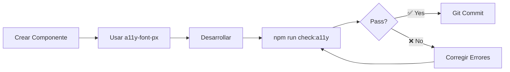

# 👋 Bienvenido al Proyecto OFTIC

## ⚡ Inicio Rápido - Primer Día

### 1. 📥 Instalación

```bash
# Clonar repositorio
git clone [URL_DEL_REPO]
cd frontend

# Instalar dependencias
npm install

# Iniciar servidor de desarrollo
npm start
```

La aplicación estará en `http://localhost:4200`

### 2. ♿ Sistema de Accesibilidad (IMPORTANTE)

Este proyecto implementa un **sistema de escalado de fuentes con 7 niveles** para cumplir con WCAG 2.1 Nivel AA.

#### 🎯 Regla #1 que DEBES saber:

```scss
✅ SIEMPRE usar esto:
font-size: calc(14px * var(--font-size-scale));

❌ NUNCA usar esto:
font-size: 14px;
```

#### 📚 Documentación Esencial

1. **⚡ [ACCESSIBILITY-QUICK-REF.md](ACCESSIBILITY-QUICK-REF.md)** ← **EMPIEZA AQUÍ**
   - Referencia rápida de 2 minutos
   - Snippets y ejemplos
   
2. **📖 [ACCESSIBILITY-GUIDE.md](ACCESSIBILITY-GUIDE.md)**
   - Guía completa del sistema
   - Lee esto en tu primer día
   
3. **✅ [ACCESSIBILITY-CHECKLIST.md](ACCESSIBILITY-CHECKLIST.md)**
   - Checklist pre-commit
   - Úsalo antes de cada commit

#### 🔧 Configuración de VS Code

Los snippets ya están configurados. Simplemente escribe:

```
a11y-font-px + Tab    → font-size: calc(14px * var(--font-size-scale));
a11y-component + Tab  → Estructura completa de componente
a11y-headings + Tab   → h1-h6 con tamaños accesibles
```

### 3. 🚀 Workflow de Desarrollo



#### Comandos Esenciales

```bash
# Desarrollo
npm start                 # Servidor de desarrollo

# Testing
npm test                  # Unit tests
npm run check:a11y        # Verificar accesibilidad ⚠️ IMPORTANTE

# Build
npm run build             # Build de producción
```

### 4. 📁 Estructura del Proyecto

```
frontend/
├── src/
│   ├── app/
│   │   ├── components/       # Componentes reutilizables
│   │   ├── pages/            # Páginas/vistas
│   │   ├── core/
│   │   │   └── services/
│   │   │       └── accessibility.service.ts  # ⭐ Servicio de accesibilidad
│   │   ├── layout/           # Header, Footer, Sidebar
│   │   └── app.routes.ts     # Rutas de la app
│   │
│   ├── styles.scss           # ⭐ Variables CSS globales (--font-size-scale)
│   └── environments/
│
├── ACCESSIBILITY-*.md        # 📚 Documentación de accesibilidad
├── check-accessibility.ps1   # 🔍 Script de verificación
└── package.json
```

### 5. 🎨 Creando tu Primer Componente

```bash
# Generar componente
ng generate component components/mi-componente
```

**En `mi-componente.scss`:**

```scss
// Opción 1: Usar snippet (RECOMENDADO)
// Escribe: a11y-component + Tab

// Opción 2: Manual
.mi-componente {
  // Tamaño de fuente responsive
  font-size: calc(14px * var(--font-size-scale));
  
  // Otros estilos...
  color: #333;
  padding: 16px;
}

// Variantes de tamaño
.mi-titulo {
  font-size: calc(20px * var(--font-size-scale));
  font-weight: 700;
}

.mi-subtexto {
  font-size: calc(12px * var(--font-size-scale));
  color: #666;
}
```

### 6. ✅ Pre-Commit Checklist

Antes de hacer commit, SIEMPRE:

```bash
# 1. Verificar accesibilidad
npm run check:a11y

# 2. Ejecutar tests (si tienes)
npm test

# 3. Verificar que compila
ng build --configuration development
```

Si `npm run check:a11y` pasa ✅, puedes hacer commit tranquilo.

### 7. 🧪 Probando Accesibilidad

#### En la Aplicación
1. Inicia sesión
2. Busca el menú flotante de accesibilidad (derecha)
3. Presiona **A+** para aumentar fuente
4. Presiona **A−** para disminuir fuente
5. Verifica que TODO el texto escala

#### En DevTools
```javascript
// Console del navegador
document.documentElement.style.setProperty('--font-size-scale', '1.75');
// Todo el texto debería escalarse a 175%
```

### 8. 🚨 Errores Comunes (y cómo evitarlos)

#### ❌ ERROR 1: Font-size fijo
```scss
// ❌ MAL
.texto { font-size: 14px; }

// ✅ BIEN
.texto { font-size: calc(14px * var(--font-size-scale)); }
```

#### ❌ ERROR 2: Usar !important
```scss
// ❌ MAL - Bloquea accesibilidad completamente
.texto { font-size: 14px !important; }

// ✅ BIEN - Sin !important
.texto { font-size: calc(14px * var(--font-size-scale)); }
```

#### ❌ ERROR 3: Olvidar verificar antes de commit
```bash
# ✅ SIEMPRE hacer esto antes de commit:
npm run check:a11y
```

### 9. 💡 Tips Pro

1. **Usa snippets**: `a11y-` + Tab es tu mejor amigo
2. **Hereda del body**: Si no necesitas tamaño específico, no definas font-size
3. **Documenta excepciones**: Si DEBES usar font-size fijo, comenta por qué
4. **Prueba extremos**: Verifica niveles 0 y 6 en mobile
5. **Ejecuta check:a11y**: Hazlo parte de tu workflow

### 10. 📞 ¿Necesitas Ayuda?

- 📖 **Dudas de accesibilidad**: Lee [ACCESSIBILITY-GUIDE.md](ACCESSIBILITY-GUIDE.md)
- ⚡ **Referencia rápida**: [ACCESSIBILITY-QUICK-REF.md](ACCESSIBILITY-QUICK-REF.md)
- ✅ **Pre-commit**: [ACCESSIBILITY-CHECKLIST.md](ACCESSIBILITY-CHECKLIST.md)
- 👥 **Equipo**: Contacta al líder técnico

### 11. 🎯 Tu Primera Tarea

Para familiarizarte con el sistema:

1. ✅ Lee [ACCESSIBILITY-QUICK-REF.md](ACCESSIBILITY-QUICK-REF.md) (2 min)
2. ✅ Crea un componente de prueba con `ng generate component test`
3. ✅ Usa snippets `a11y-*` en el archivo SCSS
4. ✅ Ejecuta `npm run check:a11y` y verifica que pasa
5. ✅ Prueba el componente en el navegador con A+/A−

---

## 🌟 Principios del Proyecto

1. **Accesibilidad first**: No es opcional
2. **Mobile responsive**: Siempre prueba en mobile
3. **Performance matters**: Optimiza imágenes y código
4. **Clean code**: Código legible es código mantenible
5. **Test before commit**: `npm run check:a11y` siempre

---

**¡Bienvenido al equipo! 🎉**

Si completaste esta guía, ya sabes lo esencial para contribuir al proyecto. 

**Siguiente paso**: Lee el [README.md](README.md) principal para más detalles técnicos.
